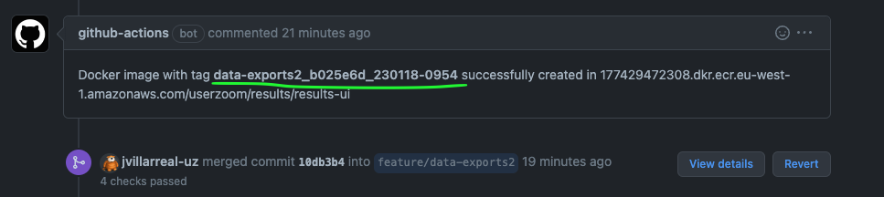
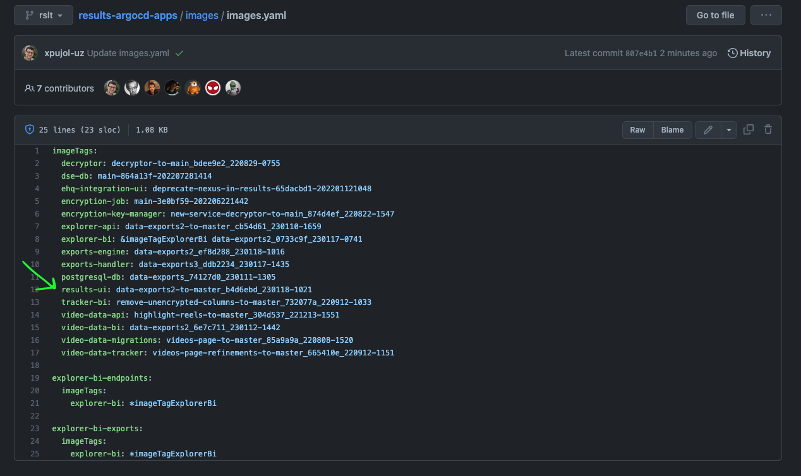
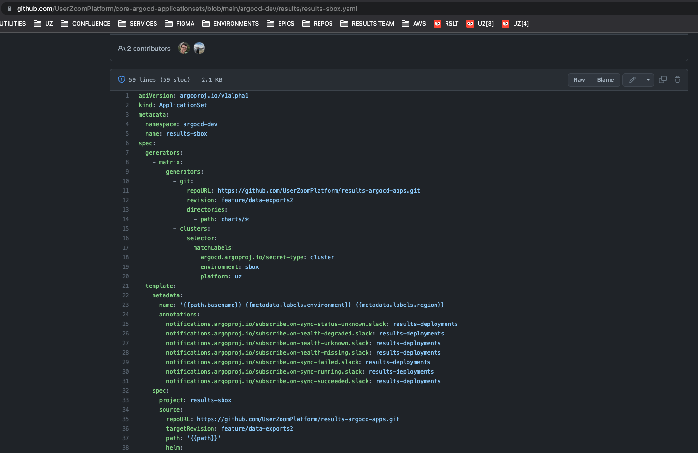

# DEPLOY PROCESS

## RSLT env
Follow process described below to deploy new image in RSLT env
1. Merge PR
2. Get docker image id from GH action
   
3. Access to [UserZoomPlatform/results-argocd-apps](https://github.com/UserZoomPlatform/results-argocd-apps)
4. Checkout to branch `rslt`
5. Move to folder `/images`
6. Open file `images.yaml` [(source)](https://github.com/UserZoomPlatform/results-argocd-apps/blob/rslt/images/images.yaml)
7. Update file with new docker image id for key `results-ui`
   
8. Commit changes

## SANDBOX env
Follow process described below to deploy new docker image in SANDBOX (aka SBOX) env. 

### Check target brach
This process requires a previous check before updating docker image id in ArgoCD, as far as it's necessary to know which is target branch for dev enviroment.

1. Access to [UserZoomPlatform/core-argocd-applicationsets](https://github.com/UserZoomPlatform/core-argocd-applicationsets)
2. Move to folder `/argocd-dev/results`
3. Open file `results-sbox.yaml` [(source)](https://github.com/UserZoomPlatform/core-argocd-applicationsets/blob/main/argocd-dev/results/results-sbox.yaml)
4.  Check keys `revision` and `targetRevision`. Their value is pointing the target `results-argocd-apps` branch.
   

## Get docker image ID
1. Go to PR [feature/data-exports2 into master](https://github.com/UserZoomPlatform/results-ui/pull/602). (This PR is in `Draft` mode and generates a new docker image after merging any new development in `results-ui` repo)
2. Get docker image id from GH action

## Update docker image
1. Access to [UserZoomPlatform/results-argocd-apps](https://github.com/UserZoomPlatform/results-argocd-apps)
2.  Checkout to branch targeted in `results-sbox.yaml` (according this example, target branch should be `feature?data-exports2`)
3.  Move to folder `/images`
4.  Open file `images.yaml`
5.  Update file with new docker image id for key `results-ui`
   
6.  Commit changes

